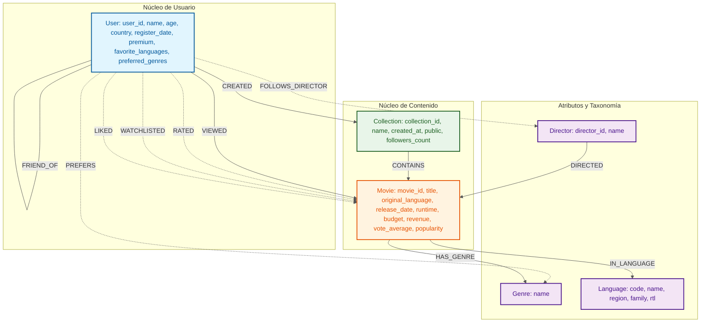

# ETAPA 02 - Diseño del Grafo

## 1) Diagrama

## 2) Labels y propiedades

### User
- `user_id`: string
- `name`: string
- `age`: integer
- `country`: string
- `register_date`: date
- `premium`: boolean
- `favorite_languages`: list<string>
- `preferred_genres`: list<string>

### Movie
- `movie_id`: string
- `title`: string
- `original_language`: string
- `original_title`: string
- `release_date`: date
- `runtime`: float
- `budget`: integer
- `revenue`: integer
- `vote_average`: float
- `popularity`: float

### Genre
- `name`: string
- `description`: string
- `popularity_index`: float
- `active`: boolean
- `created_at`: date

### Director
- `director_id`: string
- `name`: string
- `nationality`: string
- `birth_date`: date
- `active`: boolean

### Language
- `code`: string
- `name`: string
- `region`: string
- `family`: string
- `rtl`: boolean

### Collection
- `collection_id`: string
- `name`: string
- `created_at`: date
- `public`: boolean
- `followers_count`: integer

## 3) Tipos de relación

1. `VIEWED` (User -> Movie)
2. `RATED` (User -> Movie)
3. `PREFERS` (User -> Genre)
4. `FRIEND_OF` (User <-> User)
5. `HAS_GENRE` (Movie -> Genre)
6. `DIRECTED` (Director -> Movie)
7. `IN_LANGUAGE` (Movie -> Language)
8. `WATCHLISTED` (User -> Movie)
9. `LIKED` (User -> Movie)
10. `FOLLOWS_DIRECTOR` (User -> Director)
11. `CONTAINS` (Collection -> Movie)
12. `CREATED` (User -> Collection)